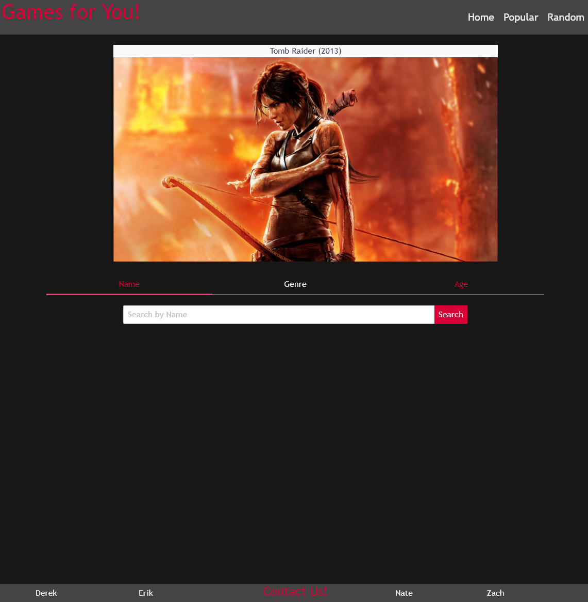
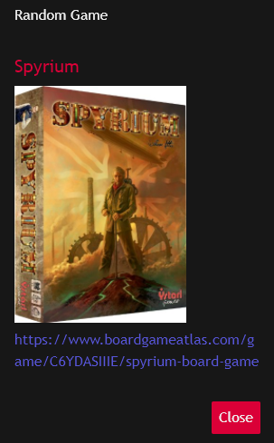
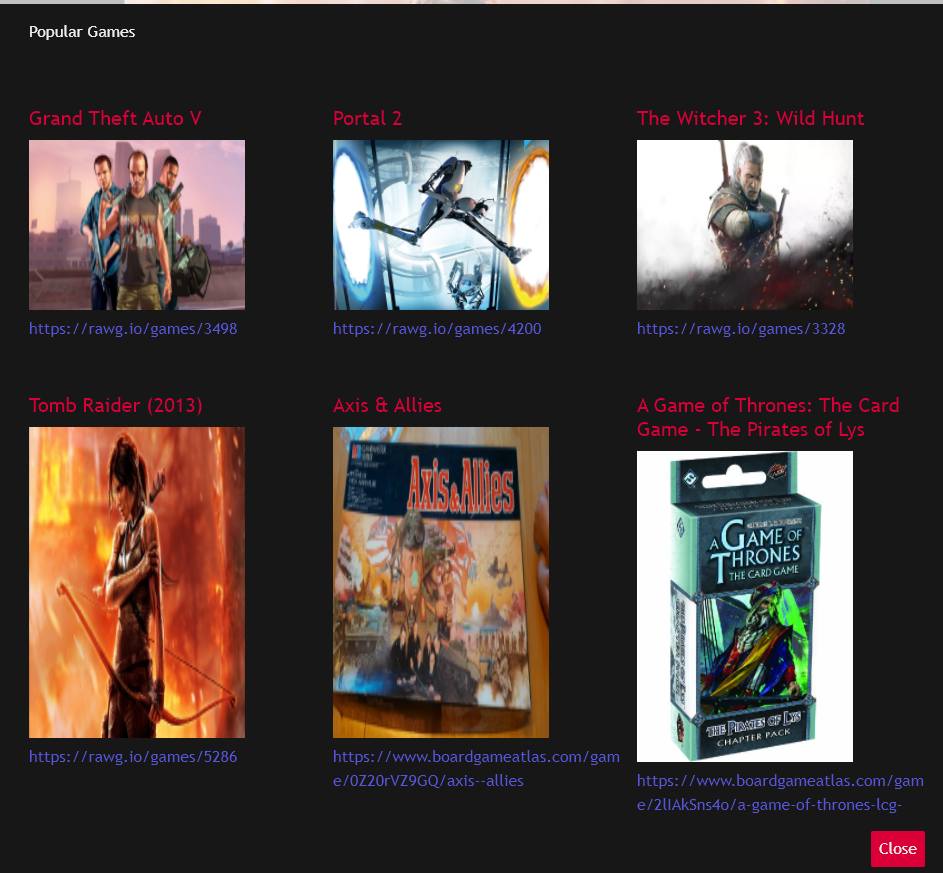
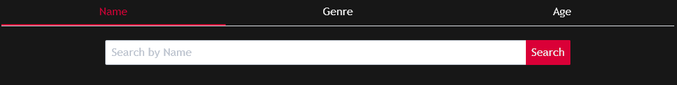
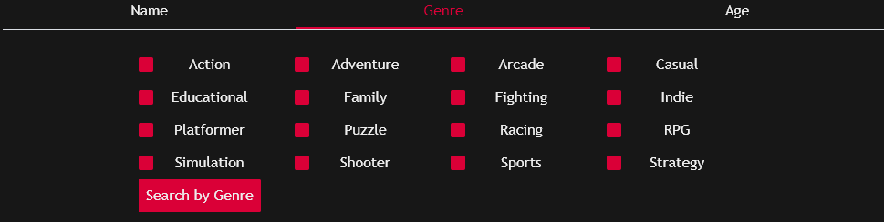
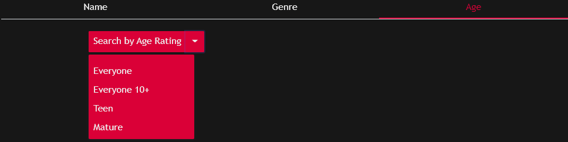
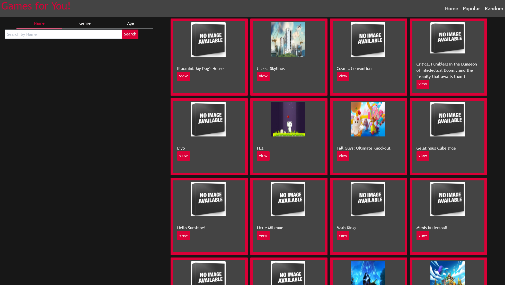
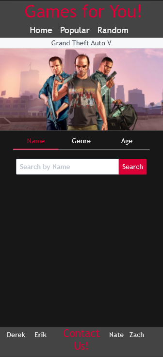
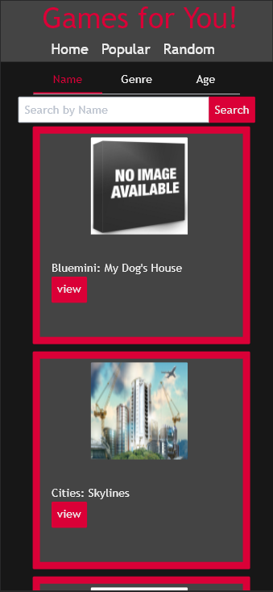

# Games For You
​
## Deployed at: https://delizoderek.github.io/Games-for-you/
​
## Developed by: Derek Delizo, Erik Lew, Nathaniel Turcotte, and Zach Maurer
​
## Technologies Used
- [Spectre CSS](https://picturepan2.github.io/spectre/getting-started/installation.html)
- [Board Game Atlas API](https://www.boardgameatlas.com/api/docs)
- [RAWG API](https://rawg.io/apidocs)
- [Git](https://git-scm.com/)

### User Story
​
```md
AS A game enthusiast
I WANT to be able to search for games
SO THAT I can find games easier
```
​
### Acceptance Criteria
​
```md
GIVEN I am using a web application to search for games
WHEN I search by name
THEN I am shown games matching the name I input
WHEN I search by genre
THEN I am shown games from the matching genres
WHEN I search by age rating
THEN I am shown games from the matching age rating
WHEN I click on random
THEN I am shown a random game
WHEN I click on popular
THEN I am shown popular games
```
​
​
The purpose of this web application is to have a web page where you can easily search for video games and board games. Upon loading the web application you will see the landing page.

​
​


​
​
Clicking on the Random Button in the top right side of the screen will display a random game for you.

​
​

​
​
Clicking on the Popular button will show you the four most popular video games and the four most popular board games.
​
​

​
​
Underneath the carousel you will find the tabs for search parameters. You can search by name.
​


​
​
You can search by genre.
​
​

​
​
And you can search by age rating.
​
​

​
​
At the bottom of the landing page there is also a footer with links to contact us.
​
​

​
​
When you submit a search request you will be taken to the search results page. This page also has all the functionality of the landing page.
​
​

​
​
### Mobile Formatting
​
​
Our application is formatted for mobile devices as well as desktop devices.
​
​


​<br>
<br>
​
Copyright <YEAR> <COPYRIGHT HOLDER>
​
Permission is hereby granted, free of charge, to any person obtaining a copy of this software and associated documentation files (the "Software"), to deal in the Software without restriction, including without limitation the rights to use, copy, modify, merge, publish, distribute, sublicense, and/or sell copies of the Software, and to permit persons to whom the Software is furnished to do so, subject to the following conditions:
​
The above copyright notice and this permission notice shall be included in all copies or substantial portions of the Software.
​
THE SOFTWARE IS PROVIDED "AS IS", WITHOUT WARRANTY OF ANY KIND, EXPRESS OR IMPLIED, INCLUDING BUT NOT LIMITED TO THE WARRANTIES OF MERCHANTABILITY, FITNESS FOR A PARTICULAR PURPOSE AND NONINFRINGEMENT. IN NO EVENT SHALL THE AUTHORS OR COPYRIGHT HOLDERS BE LIABLE FOR ANY CLAIM, DAMAGES OR OTHER LIABILITY, WHETHER IN AN ACTION OF CONTRACT, TORT OR OTHERWISE, ARISING FROM, OUT OF OR IN CONNECTION WITH THE SOFTWARE OR THE USE OR OTHER DEALINGS IN THE SOFTWARE.
